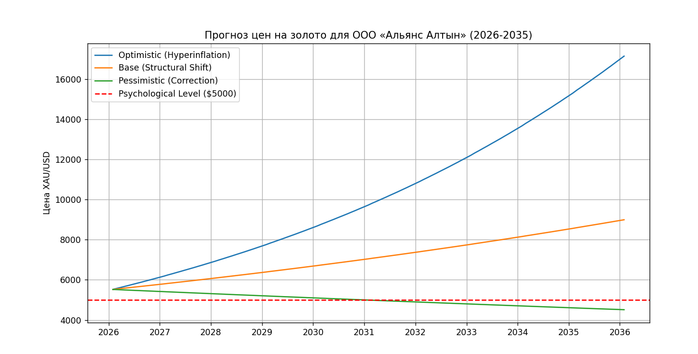

# Alliance Altyn Price Forecaster (2026-2035)

Аналитическая система прогнозирования цен на драгоценные металлы, разработанная для олимпиады FinOlimp 2026.

## 📌 Описание
Система строит сценарные прогнозы цен на золото (XAU/USD) и серебро (XAG/USD) на период до 10 лет, учитывая макроэкономические факторы (DXY, Brent, UST 10Y).

## 🛠 Технологический стек
- **Язык:** Python 3.10+
- **Библиотеки:** Pandas, NumPy, Scikit-learn, YFinance, Matplotlib
- **IDE:** IntelliJ IDEA

## 🚀 Инструкция по запуску
1. Установите зависимости:
   ```bash
   pip install -r requirements.txt
   Загрузите актуальные данные:

Bash
python src/data_loader.py
Выполните предобработку:

Bash
python src/preprocessor.py
Сгенерируйте прогноз и отчеты:

Bash
python src/forecaster.py
... (твой текущий блок с установкой и запуском) ...

## 📊 Визуализация и результаты прогноза
Для анализа были использованы три сценария развития рынка до 2035 года. Ниже представлен график прогнозных значений XAU/USD:



> **Примечание:** Красная пунктирная линия обозначает психологическую отметку $5,000, пройденную в начале 2026 года.

## 📈 Ключевые метрики (на 5 лет)
| Сценарий | Прогноз на 2031 год | Обоснование |
| :--- | :--- | :--- |
| **Оптимистичный** | $9,700+ | Гиперинфляция и дефицит предложения |
| **Базовый** | $7,048 | Структурный сдвиг и переоценка валют |
| **Пессимистичный** | $4,500 | Глобальная дефляция и коррекция |
